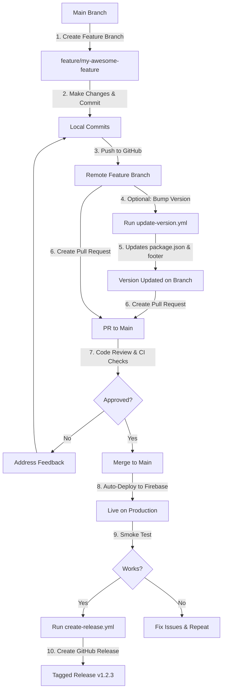
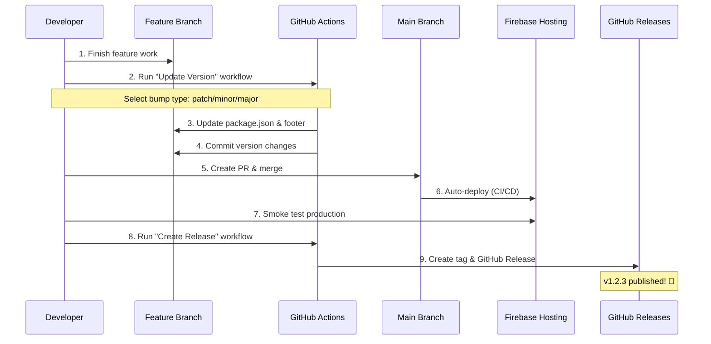

# Contributing to RecipesGalore Web

Welcome! 🎉 We're excited you're interested in contributing to RecipesGalore! This is an open source project with a warm, welcoming community. Whether you're fixing a typo, adding a feature, or just exploring, we appreciate your time and effort.

## 🌟 Project Philosophy

- **Keep It Simple** - We favor straightforward solutions over complex ones
- **Quality First** - Security and reliability matter more than speed
- **Incremental MVP** - Small, working improvements beat big, broken features
- **Open Source** - Transparent, collaborative, and community-driven

## 📋 Table of Contents

- [Code of Conduct](#code-of-conduct)
- [Getting Started](#getting-started)
- [Development Workflow](#development-workflow)
- [Version Bumping and Releases](#version-bumping-and-releases)
- [Pull Request Process](#pull-request-process)
- [Testing](#testing)
- [Style Guidelines](#style-guidelines)
- [Security](#security)
- [Questions?](#questions)

## 📜 Code of Conduct

Be respectful, inclusive, and collaborative. We're building software for home cooks and recipe enthusiasts - let's keep the vibes warm and welcoming!

## 🚀 Getting Started

### Prerequisites

- **Node.js** v20 or higher
- **npm** (comes with Node.js)
- **Git**
- **GitHub account**

### Setup Your Development Environment

1. **Fork the repository** on GitHub

2. **Clone your fork**
   ```bash
   git clone https://github.com/YOUR-USERNAME/recipesgalore-web.git
   cd recipesgalore-web
   ```

3. **Add upstream remote**
   ```bash
   git remote add upstream https://github.com/CrismonicWave-org/recipesgalore-web.git
   ```

4. **Install dependencies**
   ```bash
   npm install
   ```

5. **Run the development server**
   ```bash
   npm start
   ```
   
   Open http://localhost:4200 in your browser!

6. **Verify everything works**
   ```bash
   npm run build
   npm test
   ```

## 🔄 Development Workflow

We use a **feature branch workflow** with pull requests. Here's the complete flow:



### Step-by-Step Process

#### 1. Create a Feature Branch

```bash
# Make sure you're on main and up to date
git checkout main
git pull upstream main

# Create your feature branch
git checkout -b feature/add-recipe-search
```

**Branch Naming Conventions:**
- `feature/` - New features (e.g., `feature/user-login`)
- `fix/` - Bug fixes (e.g., `fix/broken-navigation`)
- `docs/` - Documentation updates (e.g., `docs/update-readme`)
- `chore/` - Maintenance tasks (e.g., `chore/update-dependencies`)

#### 2. Make Your Changes

- Write clean, readable code
- Follow existing code style
- Add comments where helpful (but don't over-comment)
- Test your changes locally

```bash
# Test as you develop
npm start  # Run dev server
npm test   # Run tests
```

#### 3. Commit Your Changes

We follow [Conventional Commits](https://www.conventionalcommits.org/):

```bash
git add .
git commit -m "feat: add recipe search functionality

- Add search input to homepage
- Implement search filter logic
- Update tests for search feature"
```

**Commit Message Format:**
- `feat:` - New feature
- `fix:` - Bug fix
- `docs:` - Documentation changes
- `style:` - Code formatting (no logic changes)
- `refactor:` - Code restructuring (no behavior changes)
- `test:` - Adding or updating tests
- `chore:` - Maintenance tasks

#### 4. Push to Your Fork

```bash
git push origin feature/add-recipe-search
```

#### 5. Create a Pull Request

1. Go to the [recipesgalore-web repository](https://github.com/CrismonicWave-org/recipesgalore-web)
2. Click "Pull requests" → "New pull request"
3. Click "compare across forks"
4. Select your fork and branch
5. Fill in the PR template with:
   - **Description** of what changed
   - **Why** the change is needed
   - **Testing** you performed
   - **Screenshots** (if UI changes)

#### 6. Code Review & CI Checks

Your PR will automatically:
- ✅ Run build verification
- ✅ Run tests
- ✅ Check code quality

A maintainer will review your PR and may:
- Approve and merge ✅
- Request changes 📝
- Ask questions 💬

**Please be patient!** Maintainers are volunteers and may take a few days to review.

## 🏷️ Version Bumping and Releases

### When to Bump the Version

Version bumping is typically done by **maintainers** before releasing new features or fixes. If you're a contributor, **you usually don't need to worry about this** - just focus on your feature!

However, if you're a maintainer or want to create a release, here's how:

### Version Bump Workflow



### How to Bump Version (Maintainers Only)

#### Step 1: Run Update Version Workflow

1. Go to **Actions** → **Update Version**
2. Click "Run workflow"
3. **Important:** Select your feature branch (NOT main!)
4. Choose bump type:
   - **patch** - Bug fixes (0.1.0 → 0.1.1)
   - **minor** - New features (0.1.0 → 0.2.0)
   - **major** - Breaking changes (0.1.0 → 1.0.0)
5. Click "Run workflow"

The workflow will:
- ✅ Calculate new version
- ✅ Update `package.json`
- ✅ Update footer display (`src/app/app.html`)
- ✅ Commit changes to your branch
- ✅ Push to GitHub

#### Step 2: Create PR & Merge

Follow the normal PR process. The version changes will be reviewed along with your feature.

#### Step 3: Deploy & Test

After merging, Firebase will automatically deploy. Test the live site to ensure everything works.

#### Step 4: Create GitHub Release

1. Go to **Actions** → **Create Release**
2. Click "Run workflow"
3. **Always run on main branch**
4. Add optional release notes (highlights, known issues, etc.)
5. Click "Run workflow"

The workflow will:
- ✅ Read version from `package.json`
- ✅ Create git tag (e.g., `v0.2.0`)
- ✅ Generate changelog from commits
- ✅ Publish GitHub Release

🎉 **Done!** Your release is now public.

## 🔍 Pull Request Process

### Before Submitting

- [ ] Code builds successfully (`npm run build`)
- [ ] Tests pass (`npm test`)
- [ ] Code follows style guidelines
- [ ] Commits follow conventional commit format
- [ ] Branch is up to date with main
- [ ] PR description is clear and complete

### PR Review Checklist

Reviewers will check:
- ✅ Code quality and readability
- ✅ Tests are included and pass
- ✅ No security vulnerabilities (GHAS scan)
- ✅ Follows project conventions
- ✅ Documentation updated (if needed)
- ✅ UI changes look good (screenshots required)

### After Approval

Once approved, a maintainer will:
1. Merge your PR to main
2. Automatic deployment to Firebase happens
3. Thank you for your contribution! 🙌

## 🧪 Testing

We believe in quality! Please test your changes.

### Run Tests Locally

```bash
# Run all tests
npm test

# Run tests in watch mode (during development)
npm test -- --watch

# Run build to verify production bundle
npm run build
```

### Manual Testing

1. Start dev server: `npm start`
2. Open http://localhost:4200
3. Test your feature thoroughly
4. Check different screen sizes (mobile, tablet, desktop)
5. Verify accessibility (keyboard navigation, screen readers)

## 🎨 Style Guidelines

### Code Style

- **TypeScript**: Use types, avoid `any`
- **Components**: Keep them focused and small
- **CSS**: Use existing color variables (defined in `src/styles.css`)
- **Naming**: Descriptive names over clever ones
- **Comments**: Explain *why*, not *what*

### Angular Conventions

- Use standalone components
- Follow Angular style guide
- Prefer reactive patterns
- Keep templates readable

### Color Palette

Stick to our warm, food-friendly colors:

```css
/* Navigation & Primary */
--primary-gradient: linear-gradient(135deg, #e17055 0%, #d63031 100%);
--primary-orange: #e17055;
--primary-red: #d63031;

/* Backgrounds */
--bg-cream: #fdfbf7;
--bg-light-peach: rgba(250, 177, 160, 0.1);

/* Accents */
--accent-green: #00b894;
--accent-peachy: #fab1a0;

/* Text */
--text-dark: #2d3436;
```

## 🔒 Security

Security is a top priority! Please review our [SECURITY.md](SECURITY.md) for:
- How to report security vulnerabilities
- Our security practices (GHAS scanning)
- Responsible disclosure guidelines

**Never commit:**
- Passwords or API keys
- Service account credentials
- Personal data
- Secrets of any kind

We use **GitHub Advanced Security (GHAS)** to scan for vulnerabilities automatically.

## ❓ Questions?

### Need Help?

- **Issues**: Check [existing issues](https://github.com/CrismonicWave-org/recipesgalore-web/issues)
- **Discussions**: Start a [discussion](https://github.com/CrismonicWave-org/recipesgalore-web/discussions)
- **Email**: kencrismon@crismonicwave.com

### Found a Bug?

[Open an issue](https://github.com/CrismonicWave-org/recipesgalore-web/issues/new) with:
- Clear description of the problem
- Steps to reproduce
- Expected vs actual behavior
- Screenshots (if applicable)
- Environment details (OS, browser, etc.)

### Want to Propose a Feature?

[Open a discussion](https://github.com/CrismonicWave-org/recipesgalore-web/discussions) first! Let's chat about:
- What problem it solves
- How it fits with our philosophy
- Potential implementation approaches

Once there's consensus, we'll convert it to an issue and you can start coding!

## 🙏 Thank You!

Every contribution makes RecipesGalore better. Whether it's:
- Fixing a typo
- Improving documentation
- Adding a feature
- Reporting a bug
- Helping other contributors

**You're making a difference!** Thank you for being part of our open source community. 🎉

---

**Happy Cooking... err... Coding!** 👨‍🍳👩‍💻
